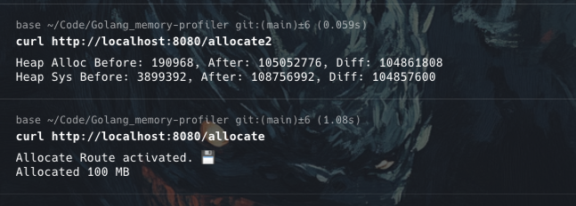
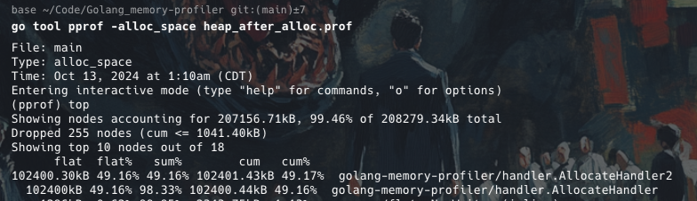

# Go Memory Profiler


This project demonstrates how to use Go's built-in tools to profile memory usage in a simple HTTP server application. It's designed for beginners to understand memory concepts and profiling in Go, including both automated profiling and direct memory measurements.

## Key Concepts

- **Memory Allocation**: The process of reserving a portion of computer memory for program use.
- **Heap**: A region of a program's memory used for dynamic allocation. Unlike the stack, heap memory is not automatically freed when a function returns.
- **Garbage Collection**: An automatic memory management process that frees heap memory that's no longer in use.
- **Profiling**: The process of analyzing a program's behavior, particularly its memory usage and performance.

## Project Structure

```
go-memory-profiling/
├── main.go               # The entry point of our application
├── handler/
│   └── handler.go        # Contains HTTP request handlers
├── profiling/
│   └── profiling.go      # Sets up profiling tools
├── go.mod                # Go module file
└── README.md             # Project documentation
```

## Prerequisites

- Go 1.16 or later
- Git

## Setup

1. Clone this repository:
   ```
   git clone https://github.com/yourusername/go-memory-profiling.git
   cd go-memory-profiling
   ```

2. Initialize the Go module:
   ```
   go mod init github.com/yourusername/go-memory-profiling
   ```

## Running the Application

To run the application:

```
go run main.go
```

The server will start on `http://localhost:8080`.

## Understanding the Code

Each file in this project contains detailed comments explaining what each part does and why. The main components are:

- `main.go`: Sets up the HTTP server and routes.
- `handler/handler.go`: Contains three handlers:
  - `HelloHandler`: A simple greeting handler.
  - `AllocateHandler`: Demonstrates large memory allocation for profiling.
  - `AllocateHandler2`: Provides direct memory measurement using `runtime.ReadMemStats`.
- `profiling/profiling.go`: Configures profiling settings.

## Profiling and Memory Analysis

1. Access the pprof interface at `http://localhost:8080/debug/pprof/`.

2. Generate a heap profile:
   ```
   go tool pprof http://localhost:8080/debug/pprof/heap
   ```

3. Generate a 30-second CPU profile:
   ```
   go tool pprof http://localhost:8080/debug/pprof/profile?seconds=30
   ```

4. View goroutines:
   ```
   go tool pprof http://localhost:8080/debug/pprof/goroutine
   ```

5. Direct memory measurement:
   Visit `http://localhost:8080/allocate2` to see real-time memory allocation statistics.

## Analyzing Profiles

`Terminal Curl HTTP Request`


`Terminal Profiler`


In the pprof interactive mode:

- `top`: Shows the top memory-consuming functions
- `web`: Generates a graph visualization (requires Graphviz)
- `list <function>`: Shows line-by-line memory usage for a function

## Comparing Profiler Data with Direct Measurements

This project allows you to compare profiler output with direct memory measurements:

1. Use `AllocateHandler` (`/allocate`) to trigger a large allocation and observe it in the profiler.
2. Use `AllocateHandler2` (`/allocate2`) to see the exact memory allocated using `runtime.ReadMemStats`.
3. Compare these results to understand the accuracy of the profiler and the actual memory behavior of your application.
